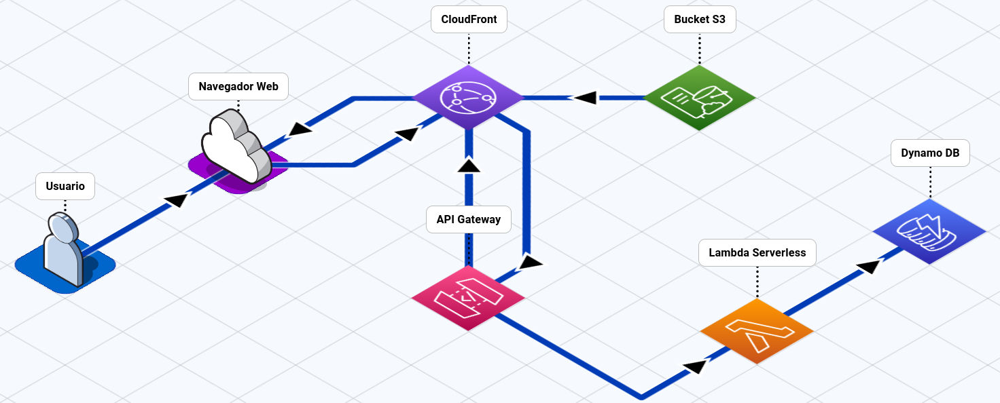

# EVALUACIÓN TÉCNICA GRUPO PB

`Enlace público:`  [LINK DE ACCESO](https://d3ac1wp9stitih.cloudfront.net/) 👈

## Tabla de Contenidos

- [Introducción](#introducción)
- [Arquitectura](#arquitectura)
- [Requerimientos del Sistema](#requerimientos-del-sistema)
- [Requerimientos del Sistema](#requerimientos-del-sistema)
  - [Requerimientos Funcionales](#requerimientos-funcionales)
  - [Requerimientos No Funcionales](#requerimientos-no-funcionales)
- [Estrategia de Landing Page](#estrategia-de-landing-page)
- [Modelo de base de datos (NoSQL)](#modelo-de-base-de-datos-nosql)
- [Decisiones Técnicas)](#decisiones-técnicas)
  - [Frontend](#frontend)
  - [Backend](#backend)
  - [Base de Datos](#base-de-datos)
- [Mejoras Futuras)](#mejoras-futuras)
  - [Infraestructura como Código](#infraestructura-como-código)
  - [CI/CD](#cicd)
  - [Pruebas automatizadas](#pruebas-automatizadas)
  - [Seguridad](#Seguridad)
  - [Observabilidad](#observabilidad)
- [Ejecución Local)](#ejecución-local)
  - [Requisitos](#requisitos)

## Introducción

El proyecto consiste en una landing page responsiva desarrollada para el lanzamiento conceptual de PREDIX AI, una solución ficticia enfocada en la predicción de partidos de fútbol mediante inteligencia artificial.

La landing page tiene como objetivo presentar el producto y permitir que los usuarios se registren para recibir información relacionada con su lanzamiento.

El registro se realiza mediante un formulario cuyos datos son enviados a una API desplegada en AWS. La información es validada y posteriormente almacenada en una base de datos NoSQL.

La solución busca demostrar la integración entre frontend, backend, servicios serverless y almacenamiento en la nube, manteniendo una arquitectura sencilla y escalable.

## Arquitectura



---

## Requerimientos del Sistema

### Requerimientos Funcionales

- `RF-01:` Creación de una landing page con tema libre.
- `RF-02:` Formulario con validación de datos como el nombre, correo, teléfono, mensaje, etc
- `RF-03:` Envío de información de formulario a través de una función Lambda.
- `RF-04:` Se almacena la información en una base de datos en AWS.
- `RF-05:` La UI debe brindar feedback al usuario en cada acción (indicadores de carga, manejo de errores, mensajes de confirmación, validaciones de campos, etc).
- `RF-06:` El sistema debe de brindar retroalimentación clara sobre el resultado del envío (éxito, error, validaciones).

### Requerimientos No Funcionales

- `RNF-01:` Arquitectura global Serverless utilizando AWS.
- `RNF-02:` Landing page alojado en un bucket S3 de AWS y distribuida a través de CloudFront.
- `RNF-03:` El formulario debe conectarse a una función Lambda a través de una API Gateway de AWS.
- `RNF-04:` La Lambda debe de conectarse a una base de datos de AWS donde se almacenará la información capturada en el formulario.
- `RNF-05:` Toda la solución debe estar publicada utilizando los servicios de AWS: S3 + CloudFront, Lambda y API Gateway para el backend.

---

## Estrategia de Landing Page

Se creará una landing page que muestre información acerca del lanzamiento de algún nuevo producto y que este tenga un formulario para que el usuario se pueda suscribir y reciba notificaciones de las actualizaciones del mismo.

---

## Modelo de base de datos (NoSQL)

Para el almacenamiento se utiliza Amazon DynamoDB, debido a que el caso de uso consiste principalmente en registrar y consultar información de suscripciones sin requerir relaciones complejas entre entidades.

El modelo conceptual es:

```json
{
  "subscriptions": {
    "subscription_id": "UUID",
    "name": "String",
    "email": "String",
    "ip_address": "String",
    "createdAt": "String",
    "user_agent": "String"
  }
}
```

---

## Decisiones Técnicas

### Frontend

Se utilizó:

React
TypeScript
Vite
Tailwind CSS

Se seleccionó React por su modelo basado en componentes y por permitir dividir la interfaz en elementos reutilizables, facilitando el mantenimiento y evolución de la aplicación.

TypeScript

Se utiliza TypeScript para agregar tipado estático al proyecto y detectar posibles errores durante el desarrollo.

Vite

Vite fue seleccionado como herramienta de construcción debido a su rapidez durante el desarrollo y a la simplicidad de su configuración.

Tailwind CSS

Se utilizó Tailwind CSS para construir una interfaz responsiva de forma rápida y mantener los estilos directamente relacionados con los componentes que los utilizan.

### Backend

El backend utiliza:

Amazon API Gateway
AWS Lambda
Node.js

API Gateway funciona como punto de entrada para las solicitudes provenientes del frontend, mientras que Lambda contiene la lógica de validación y procesamiento antes de almacenar la información.

Se seleccionó Node.js para Lambda debido a su integración directa con el ecosistema JavaScript/TypeScript utilizado en el frontend, además de permitir desarrollar una solución sencilla y adecuada para el alcance de la evaluación.

La elección realizada en esta evaluación prioriza la simplicidad, rapidez de desarrollo y facilidad de mantenimiento.

### Base de Datos

Se seleccionó Amazon DynamoDB sobre una alternativa relacional como RDS debido a las características del caso de uso.

Los registros son independientes y no existe una necesidad actual de realizar relaciones complejas entre diferentes entidades. DynamoDB permite almacenar esta información mediante una solución administrada, serverless y fácilmente escalable.

Esto también permite mantener la arquitectura alineada con el objetivo de utilizar servicios serverless y reducir la infraestructura que debe administrarse manualmente.

---

## Mejoras Futuras

La implementación actual está orientada al alcance de la evaluación técnica. En un escenario productivo podrían incorporarse diferentes mejoras.

### Infraestructura como Código

Actualmente los recursos de AWS pueden configurarse directamente desde la consola. Aprovechando esto, se puede implementar la infraestructura mediante Infrastructure as Code, utilizando herramientas como Terraform.

Con esto se podría lograr:
Versionar la infraestructura.
Reproducir ambientes.
Automatizar despliegues.
Reducir configuraciones manuales.

### CI/CD

Se podría implementar un pipeline utilizando GitHub Actions para automatizar el proceso. Esto permitiría que los cambios aprobados puedan desplegarse automáticamente.

### Pruebas automatizadas

Se podrían agregar Pruebas unitarias. Pruebas de integración.
Esto para mejorar el código generado para producción.

### Seguridad

Se pueden implementar para evitar ataques ciberneticos:
Rate limiting.
Políticas IAM de mínimo privilegio.
Monitoreo y alertas.
Restricciones adicionales de CORS.
Protección contra abuso automatizado.
Auditoría de acceso.

### Observabilidad

Se podría implementar métricas y alarmas para detectar errores, latencia, entre otras que se necesiten visualizar.

---

## Ejecución Local

### Requisitos
- Node.js
- pnpm

### Instalación
```bash
pnpm install
```

### Variables de entorno

Crear un archivo `.env` a partir de `.env.example`:
`VITE_REGISTRATION_API_URL=<API_GATEWAY_URL>`

### Ejecutar en desarrollo
```bash
pnpm dev
```

### Construir para producción
```bash
pnpm build
```

Los archivos generados (carpeta dist) estarán disponibles en el directorio de distribución correspondiente para ser publicados en S3.

## Código Fuente

[Frontend](../frontend)
[Server](../server)


